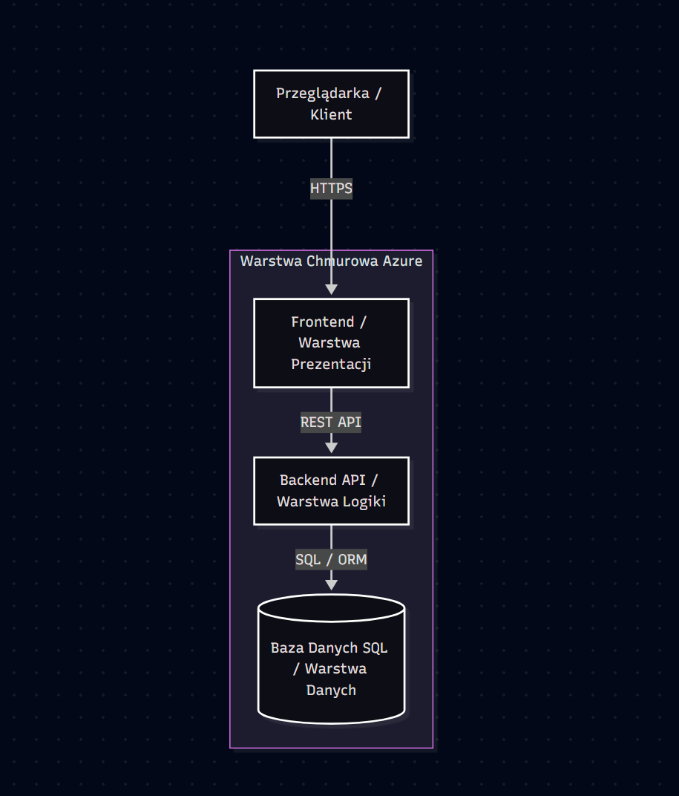

# Football Academy Management System

## Opis projektu
System do kompleksowego zarządzania szkółką piłkarską, stworzony na potrzeby projektu z architektury rozwiązań chmurowych. Aplikacja umożliwia zarządzanie kontami użytkowników (trenerzy i zawodnicy), tworzenie harmonogramu zajęć treningowych oraz zapisywanie się na wybrane treningi w oparciu o architekturę trójwarstwową (3-tier).

## Skład zespołu
* **Projekt Manager (PM):** Paweł Oszczęda
* **Frontend Developer:** Aleksandra Formantowicz
* **Backend Developer:** Dorian Pas
* **Database Administrator (DBA):** Tomasz Sawicki

## Architektura systemu (3-Tier)
Projekt wykorzystuje odizolowaną architekturę chmurową podzieloną na trzy warstwy:
1. **Warstwa prezentacji (Web/Frontend):** Odpowiada za interfejs użytkownika (panele dla trenerów oraz zawodników). Komunikuje się z klientem za pomocą szyfrowanego protokołu HTTPS.
2. **Warstwa logiki (App/Backend API):** Prywatne API obsługujące biznesową część systemu.
3. **Warstwa danych (Database):** Bezpieczna baza danych Azure SQL odizolowana od bezpośredniego ruchu zewnętrznego.

## Schemat Architektury
Poniższy diagram przedstawia architekturę 3-tier wdrożoną w chmurze Azure:

